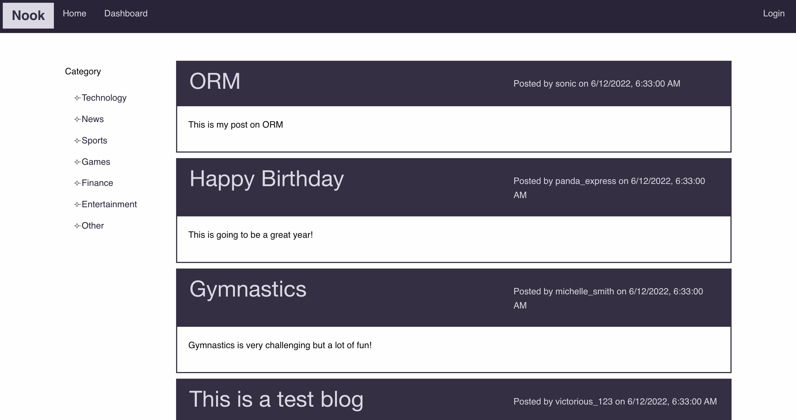
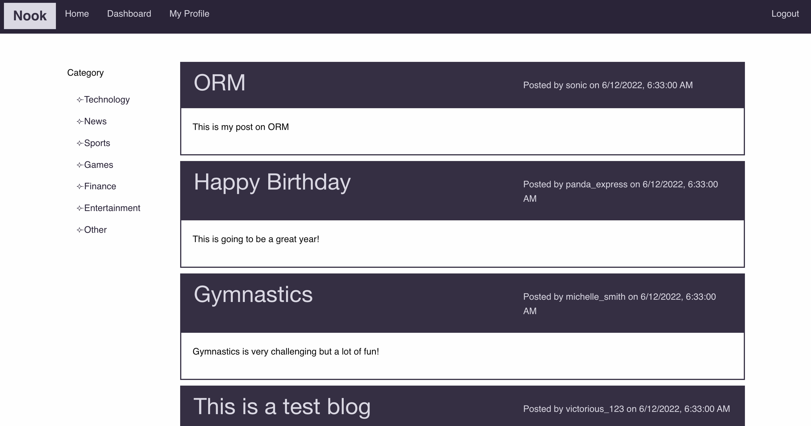
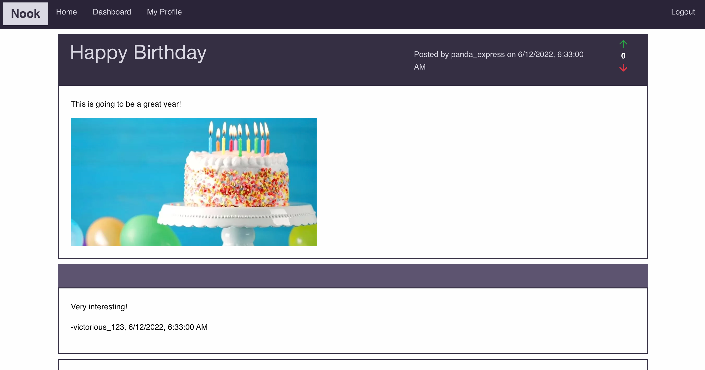
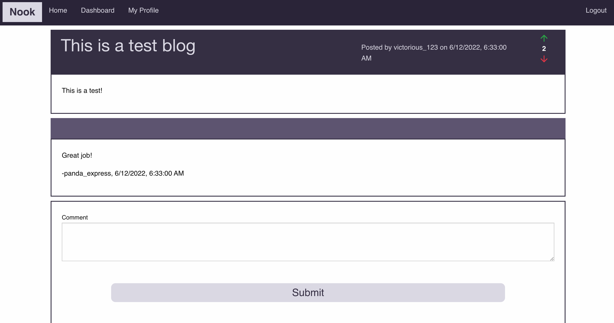
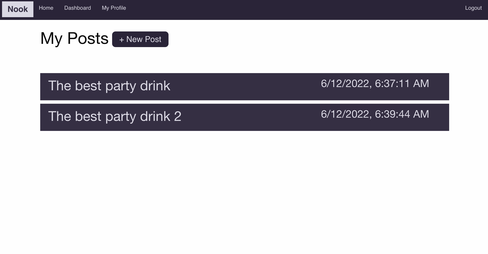

# Project 2 | Group 1 - Nook Blog

## Columbia University Bootcamp - Full-Stack Application: Nook Blog

> This repository contains our blog site, Nook, a clean and focused space that puts the users and their content back into focus and puts the rest aside!

> Live Site: https://morning-fortress-48397.herokuapp.com/

## Table of Contents

- [General Info](#general-information)
- [Technologies Used](#technologies-used)
- [Project Requirements](#project-requirements)
- [Looking Ahead](#future-development)
- [Installation](#installation)
- [Screenshots](#screenshots)
- [Contact](#contact)

## General Information

This repository contains our blog site, Nook, a clean and focused space that puts the users and their content back into focus and puts the rest aside! Using Nook, users can view other user posts, comment on the post and/or react to the post. Users can easily create their own content with images, edit content or delete content. Users can also easily manage their profile if they forget their password or want to change their password.

## Technologies Used:

- HTML
- CSS
- Bootstrap CSS Framework
- Feather Icons Library
- Node.js
- Express.js
- Handlebar.js
- MySQL
- Sequelize ORM

## Project Requirements:

### Requirements:

- Use Node.js and Express.js to create a RESTful API.
- Use Handlebars.js as the templating engine.
- Use MySQL and the Sequelize ORM for the database.
- Have both GET and POST routes for retrieving and adding new data.
- Be deployed using Heroku (with data).
- Use at least one new library, package, or technology that we haven’t discussed.
- Have a polished UI.
- Be responsive.
- Be interactive (i.e., accept and respond to user input).
- Have a folder structure that meets the MVC paradigm.
- Include authentication (express-session and cookies).
- Protect API keys and sensitive information with environment variables.
- Have a clean repository that meets quality coding standards (file structure, naming conventions, follows best practices for class/id naming conventions, indentation, quality comments, etc.).
- Have a quality README (with unique name, description, technologies used, screenshot, and link to deployed application).

### User Story:

```
AS A user who wants to find, share and discuss content
I WANT a blog site
SO THAT I can publish article/posts, react to other posts, and post comments with my thoughts and opinions
```

### Acceptance Criteria:

```
GIVEN a blog site
WHEN I visit the site for the first time
THEN I am presented with a homepage with access to view the title, content, posting information of existing posts

WHEN I am on the homepage
THEN I can filter posts by category without logging in

WHEN I want to view more details of a post
THEN I am presented with the login page to login with my username and password

WHEN I don't have login credentials
THEN I am able to sign up for an account with a username and password

WHEN I forgot my password
THEN I am able to reset my password

WHEN I log in
THEN I am able to view the full details of existing posts, add comments and/or vote on the post
THEN I am able to create my own posts, edit my posts or delete my existing posts

WHEN I look at my profile
THEN I am able to set a new password
```

## Future Development

- Allow users to upload their own images that are not hosted to use in their Post
- Allow users to sort comments by various filters
- Create custom views to let users view targeted/desired content
- Add scheduling feature to enable users to schedule posts and/or remove posts at a certain time

## Installation

1. Clone the repository to your local drive.
2. Run `npm i` in order to install the npm package dependencies as specified in the package.json file.
3. Create a .env file with your local mysql DB credentials using the example file provided.
4. Run `npm run seed` to seed the database.
5. Run `npm start` in the command line to use the application.

## Screenshots







## Contact

Created by:

- Brett Shackett | shackettbrett@gmail.com
- Jessica Chen | jessicachen28@gmail.com
- Jonghwa Choe | jonghwa101@hotmail.com
- Sneh Patel | snehp491@gmail.com
